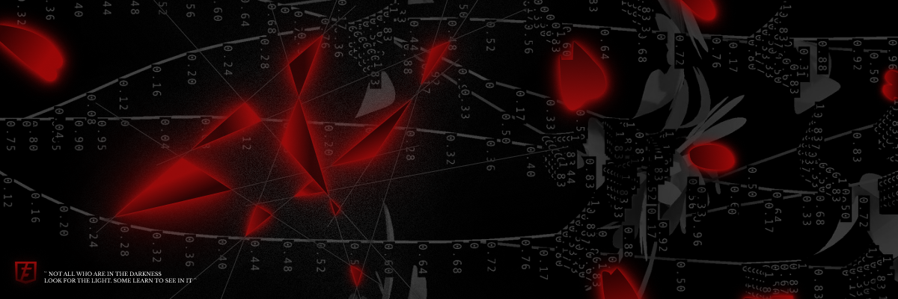

Hi  My name is Andrew
===============================================================================================================================

Web developer and programmer
----------------------------

about me ....

* ✉️  My e-mail [fursov.andrei.3097@gmail.com](mailto:fursov.andrei.3097@gmail.com)

### I know these :

### You can find me here too :

 <a href="https://www.github.com/CARAZON22" target="_blank" rel="noreferrer"> <picture> <source media="(prefers-color-scheme: dark)" srcset="https://raw.githubusercontent.com/danielcranney/readme-generator/main/public/icons/socials/github-dark.svg" /> <source media="(prefers-color-scheme: light)" srcset="https://raw.githubusercontent.com/danielcranney/readme-generator/main/public/icons/socials/github.svg" />  </picture> </a> <a href="https://discord.com/users/nashetania228" target="_blank" rel="noreferrer"> <picture> <source media="(prefers-color-scheme: dark)" srcset="https://raw.githubusercontent.com/danielcranney/readme-generator/main/public/icons/socials/discord-dark.svg" /> <source media="(prefers-color-scheme: light)" srcset="https://raw.githubusercontent.com/danielcranney/readme-generator/main/public/icons/socials/discord.svg" />  </picture> </a>

markdown
### 📈 GitHub Activity Graph:
![Anurag's GitHub activity graph](https://activity-graph.herokuapp.com/graph?user

<li style="display: inline-block; margin-right: 0.25rem;"></li>

</ul>